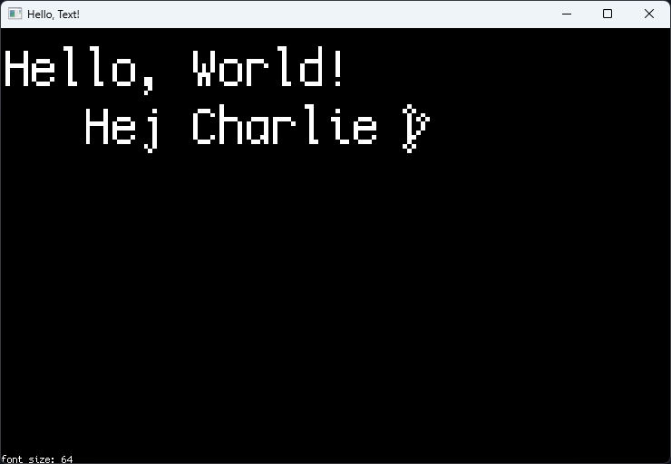

# hellotext

Rendering text in OpenGL using FreeType! The hellotext.cpp file includes all the necessary code to load a font and render it using OpenGL. It utilizes FreeType to load the desired font and uses instanced rendering to efficiently render individual characters.



## Requirements

  - [cmake](https://cmake.org/)
  - [vcpkg](https://vcpkg.io/)

## Build

Use command below to generate build system.

```
cmake -S . -Bbuild "-DCMAKE_TOOLCHAIN_FILE=${VCPKG_ROOT}/scripts/buildsystems/vcpkg.cmake"
```

## Text Rendering

The application uses FreeType 2 to read most font file types, `ttf` (**TrueTypeFont**) and `otf` (**OpenTypeFont**) and OpenGL as its backend to render it to screen. For window creation GLFW library is used as window abstraction layer.

### Resources

  - [Learn OpenGL - Text Rendering](https://learnopengl.com/In-Practice/Text-Rendering)
  - [mrandri19/freetype-opengl-experiments](https://github.com/mrandri19/freetype-opengl-experiments)
