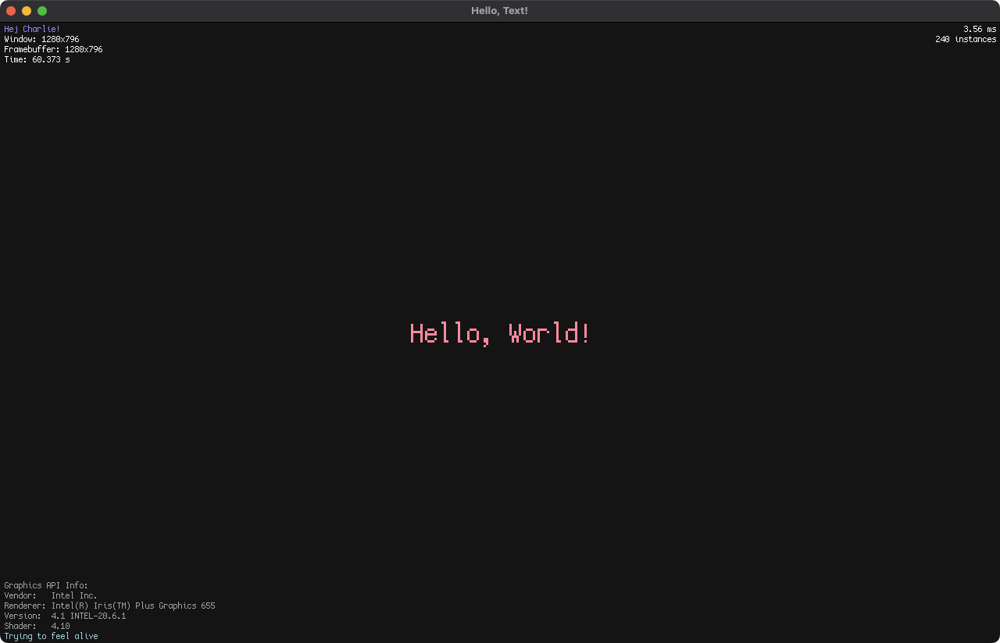

# hellotext

Rendering text in OpenGL using FreeType! The hellotext.cpp file includes all the necessary code to load a font and render it using OpenGL. It utilizes FreeType to load the desired font and uses instanced rendering to efficiently render individual characters.



## Requirements

  - [cmake](https://cmake.org/)

## Build

Use command below to generate build system.

```sh
cmake -S . -Bbuild
```

## Build Emscripten

Generate build system using `emscripten/emsdk` docker image.

```sh
docker run -it --rm -v "$(pwd):/src" emscripten/emsdk emcmake cmake -S . -Bbuild-web -DCMAKE_BUILD_TYPE=Release -DCMAKE_EXE_LINKER_FLAGS="-sUSE_GLFW=3 -sUSE_WEBGL2=1 -sFULL_ES3=1 -fexceptions --preload-file ./res/fonts/Cozette --preload-file ./shaders"
```

Copy assets.

```sh
mkdir -p build-web/res/fonts
mkdir -p build-web/shaders
cp -r res/fonts build-web/res
cp ./shaders/*.webgl.* build-web/shaders
cp index.html ./build-web
```

Build using docker

```sh
docker run -it --rm -v "$(pwd):/src" emscripten/emsdk cmake --build build-web -j
```

## Text Rendering

The application uses FreeType 2 to read most font file types, `ttf` (**TrueTypeFont**) and `otf` (**OpenTypeFont**) and OpenGL as its backend to render it to screen. For window creation GLFW library is used as window abstraction layer.

### Resources

  - [Learn OpenGL - Text Rendering](https://learnopengl.com/In-Practice/Text-Rendering)
  - [mrandri19/freetype-opengl-experiments](https://github.com/mrandri19/freetype-opengl-experiments)
